# Summary of RealTime RGB-D visual odometry algorithms
**Author**

- Hamed Jafarzadeh - Hamed.Jafarzadeh@Skoltech.ru
- Skolkovo Institue of science and technology - [Mobile Robotics Lab](<http://sites.skoltech.ru/mobilerobotics/>)
- Under supervision of [Dr. Gonzalo Ferrer](<https://faculty.skoltech.ru/people/gonzaloferrer>)

## Abstract
Visual Odometry is an incremental process which estimates the 3D pose of the camera from visual data.**The final goal of visual odometry is to estimate the movement of the camera in the environment.** This research area is relatively new and several methods and algorithm are already published. In  [the reference article][https://link.springer.com/article/10.1007/s11554-017-0670-y] , they compared several RGB-D Visual Odometry techniques to the date (2017).They used a mobile device equipped with a RGB-D camera and they measure the accuracy of each algorithm as well as CPU load. In this summary, I will summarize the main points of the article to outline the main ideas and achievements, additionally I will add some other references that helped me to understand the points better.
## Introduction
Depth sensors like kinect are being used in different application and industries in order to provide 3D data at relatively low cost. [Khoshelham et al][Khoshelham] evaluated experimentally the  accuracy of kinect sensors and proposed a `noise model` which explains why the depth error grows quadratically with the distance to the objects. The accuracy also depends on the tilt of the surface normal w.r.t the camera viewpoint and the properties of the object material. There were several attempts and products which you can find in [small size and embedded depth sensor section](#Small-size-and-embedded-depth-sensors) you can find some informations in this regard. 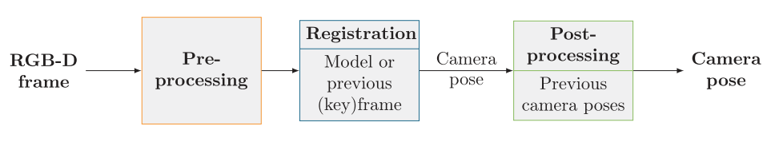

Reference paper authors proposed a benchmark and an evaluation of state-of-the-art Visual Odomtery (VO) algorithms suitable for running in real time on mobile devices with RGB-D sensor. Aim of this summary is on different algorithms and their performance, for more information on Visual Odometry and more detail information, reader can check [the reference article][https://link.springer.com/article/10.1007/s11554-017-0670-y] .

## Keynotes from the [reference article][https://link.springer.com/article/10.1007/s11554-017-0670-y] 

* They used a small-baseline RGB-D camera (PrimeSense)
* Some papers and methods used filters on depth sensors to remove noises and then performing VO
* There are several techniques for mitigating the noise in depth sensors

  * *frame-to-frame* matching strategy : comparing each frame with its previous frame *however* it leads to a large drift of the estimated trajectory as the pose errors are cumulated *so* some methods are using 

  * *frame-to-keyframe* matching strategy : choosing a high quality frame as the key-frame and matching subsequent frames with this frame, until the next key frame is chosen

  * Some methods are using IMU in order to improve the estimations quality

  * *frame-to-model* are using for building a model of the explored scene and using this model to align the new frames, the model can be a 3D point cloud. This model has the ability of re-localize the device after tracking failure.

  * Some of the methods are using some post-processing local optimizations to improve the camera pose detection and reduce the trajectory drift. however this method is not applicable to *frame-to-to-model* estimations

  * To summarize the used methods, we can take a look at this graph, clearly shows different RGB-D Visual Odometry methods 


## RGB-d Visual odometry methods

​    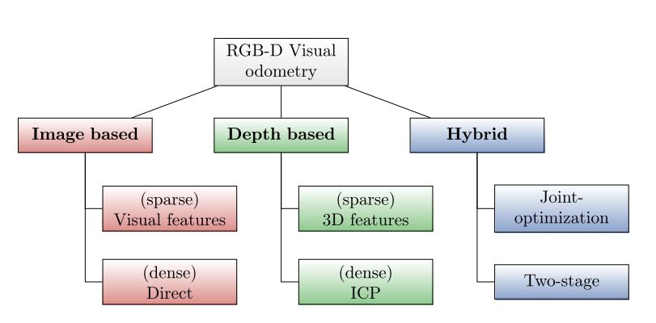


**Image-based** methods rely on the information of the RGB image and it can be divided in to feature-based methods and direct methods. 

* **`Visual features`** | sparse

> Visual features methods are using local image features to register the current frame to a previous (key)frame. SIFT and SURF features are commonly used for this approach, however their computational costs are very high. BRISK, BRIEF and ORB methods are used instead of SIFT and Surf because of their low computation costs. These methods are perfoming well in highly textured scenes and they tend to fail in poor light conditions and also blurry images.

````diff
+ Advantages:

- Disadvantages
````

* **`Direct`** | dense

> The direct methods are dense method, as the registration uses all the pixels of the images. Under the assumption that the luminosity of the pixels is invariant to small viewpoint changes, they estimate the camera motion that maximizes a photo-consistency criterion between the two considered RGB-D frames. 

````diff
+ Advantages:

- Disadvantages
````


**Depth-based** algorithms rely mostly on the information of the depth images. **Depth-based** algorithms can work well in poor light conditions as they rely on the 3D data, but on the other hand they might fail with scenes having low structure (e.g. only few planar surfaces)

* **`3D feature-based`**  | *sparse* 

> 3D feature-based methods rely on the extraction of salient features on the 3D point clouds. The rigid body transform can be computed by matching the descriptors associated to the features extracted in two frames.


````diff
+ Advantages:

- Disadvantages
````


* **`ICP - Iterative Closest Point `** | Dense

> The Iterative Closest Point methods refer to a class of registration algorithms which try to iteratively minimize the distance between two point clouds without knowing the point correspondences.  The alignment error is computed with a given error metric such as point-to-point or point-to-plane distance, and the process is repeated until this error converges or the maximal number of iterations is reached.


````diff
+ Advantages:

- Disadvantages
````

**Hybrid** algorithms try to combine the best of the two worlds in order to handle scenes having either low structure or little texture.

* **`Joint-optimizations`** 

> The joint-optimization strategy consists in designing an optimization problem which combines equations from depth-based and image-based approaches. 


````diff
+ Advantages:

- Disadvantages
````


* **`Two-stage`** 

> They usually use one approach (usually a sparse method) to compute an initial guess of the registration, and use a second approach (usually a dense method) to refine the transformation or just compute it in case of failure of the first approach.


````diff
+ Advantages:

- Disadvantages
````


### Algortihms
---


#### Fovis | *Image-Based | Feature-Based*
Fovis [20] is a fast visual odometry library developed for micro aerial vehicles (MAV). Feature based with frame-to-key-frame matching strategy.

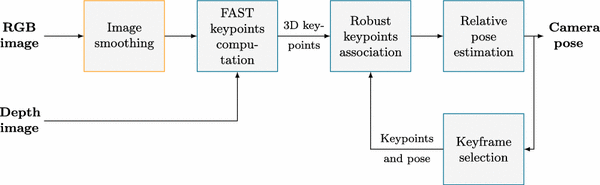

----

#### OCV RGB-D Module

It is a OpenCV RGB-D module developed by Maria Dimashova and it offers three different type :

##### 	OCV RGB-D *| Image-Based | Direct*

Image-based approach inspired by Steinbrucker et al works  [55] with a frame-to-frame matching strategy. Two hypotheses are made : 

First, the light intensity of a 3D point is considered constant between frames, then the angular and translational speed are supposed to be constant between two frames. The aglorithm finds the transformation relating two frames by minimizing the difference in intesity between warped current RGB-D frame to the previous one.

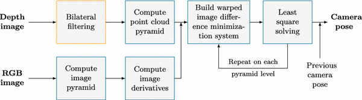


##### 	OCV ICP  *| Depth-based | ICP*

It is inspired by the point cloud registration algorithm of KinectFusion [[32](https://link.springer.com/article/10.1007/s11554-017-0670-y#CR32)]. KinectFusion ICP variant is based on a projection based heuristic association function with a point-to-plane error metric. Assuming a small rotation between the two frames, the minimization of the point-to-plane error is reduced to a linear least square problem.

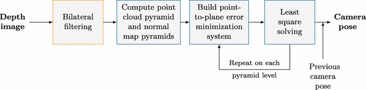

##### 	OCV RGBDICP  *| Image-Based | Direct*

It is a combination of OCV RGBD and ICP, introduced to solve the linear least square problems of  OCV ICP and RGBD methods.

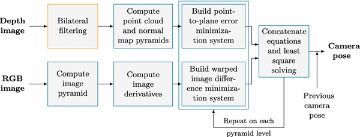

----

#### DVO (Dense Visual Odometry)

It is a direct image-based method with a frame-to-frame matching strategy. 

*(I didn't understand it completely)*

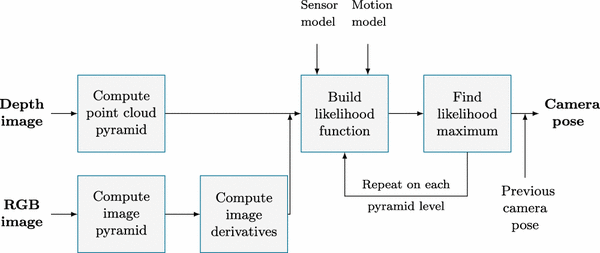


----

#### MRSMAP VO

Stückler et al. [[56](https://link.springer.com/article/10.1007/s11554-017-0670-y#CR56)] proposed a 3D feature-based approach with a frame-to-frame matching strategy in which each frame is viewed as an octree of surfels. The originality of the approach is that multiple levels of resolution can be used simultaneously since each parent node of the octree encodes the information of their children node

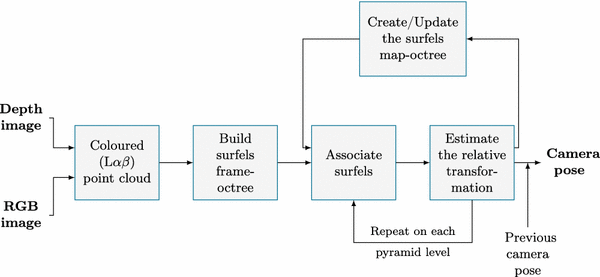

-----

####  Occipital STTracker

Structure is a depth sensor manufactured by Occipital using Primesense’s technology, and it uses structured light to estimate the depth. The sensor does not support any RGB camera, and it has to take advantage of the mobile device rear camera to retrieve the RGB frames. Occipital provides an iOS SDK with a VO algorithm in two flavours: depth-based [[35](https://link.springer.com/article/10.1007/s11554-017-0670-y#CR35)] and hybrid [[36](https://link.springer.com/article/10.1007/s11554-017-0670-y#CR36)].

----


#### FastICP


### Rangeflow


### 3D-NDT


### CCNY

 

### Demo

----

## Algorithm comparisions
Reference :  [the reference article][https://link.springer.com/article/10.1007/s11554-017-0670-y]

Dataset used : [RGB-D TUM](<https://vision.in.tum.de/data/datasets/rgbd-dataset>)


### Accuracy

#### Evaluation

There are two well-known metrics that can be used to estimate the accuracy of the estimated camera poses over time, the absolute translational error (ATE) and the translational relative pose error (RPE).

- ATE computes the Euclidean distance between the estimated camera position and its ground truth
- The ATE is then defined as the mean squared error (RMSE) of these distances all along the trajectory.
- The RPE is instead used to measure the local accuracy of the estimated trajectory over a fixed time interval Δ
- TUM has various environment dataset : The “fr1” sequences provide various scenes recorded in an office environment. 
- The “fr2” sequences were recorded in a large industrial hall. Compared to the “fr1” sequences they are generally longer and have a slower camera motion. 
- the “fr3” sequences feature a scene with a desk and various evaluation series to evaluate the performances of algorithms on scenes with structure and/or texture.

### Results

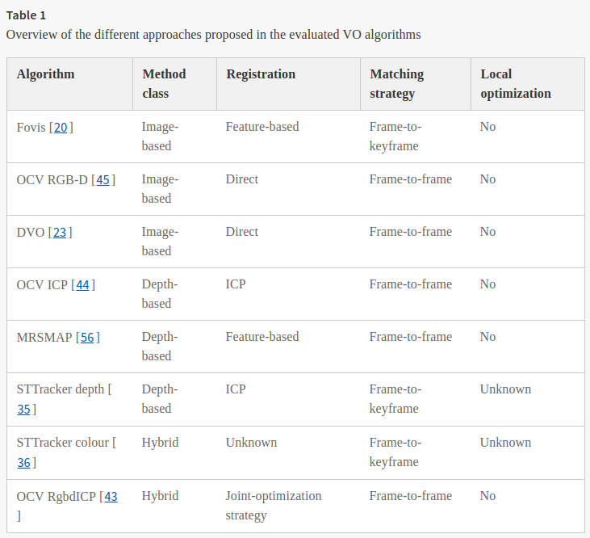

**Lower RPE Better accuracy.**

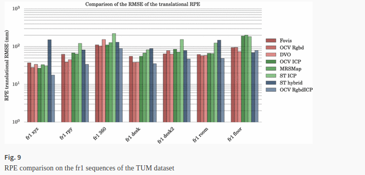

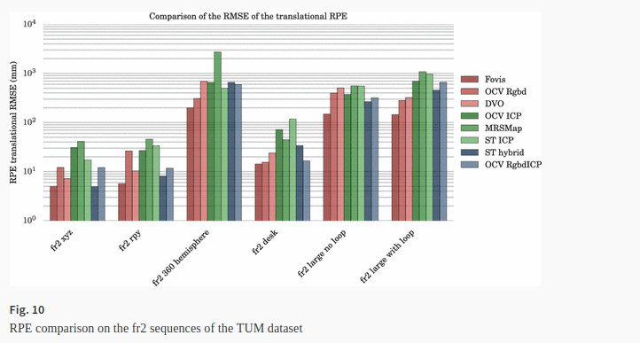

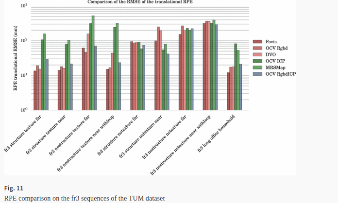

### Results outline 

- the hybrid and image-based methods are the most accurate when the environment has texture and no structure such as the scenes “fr1 floor”, “fr3 nostructure texture near withloop” and “fr3 nostructure texture far”
- Similarly, the environments with structure and low texture favour the hybrid and depth-based algorithms as shown by the scene “fr3 structure notexture near”
- noisier depth data, the accuracy of the ICP algorithm is comparable to the image-based algorithms
- When the environment is neither flat nor textureless, image-based or hybrid-based methods are more robust than depth-based methods
- the scenes recorded in the office also show the hybrid and image-based methods are more robust, but the accuracy difference with the depth-based methods is slighter
- OCV RGBD ICP [Hybrid] and Fovis *[Feature Based]* have the lowest RPE (Most accurate) on the scenes “fr1” and “fr2”
- DVO [Depth-based] and OCV RGB-D [Image-based direct] generally come behind or between

------


A first simple observation of the different graphs is that the accuracy results significantly vary from a scene to another. As stated by Fang [[13](https://link.springer.com/article/10.1007/s11554-017-0670-y#CR13)], there is no algorithm which outperforms the others in all environments. The results have to be analysed w.r.t. the scene characteristics. Therefore, the choice of VO algorithm depends on the target environment.

Apart from the challenging scenes, we described earlier and correspond to higher RPE values, the slower “fr2” (dataset in a certain environment) scenes obtain better results than the “fr1” scenes. 


### Other comparisions

[Morell-Gimenez et al](https://www.ncbi.nlm.nih.gov/pmc/articles/PMC4063070/). performed a comparision of registation methods on scenes mapping and object reconstruction scenarios. for the scenes mapping scenario which is our topic of interest, they evaluated five different algorithms : DVO, KinFu (Kinect Fusion implementation), an ICP approach, an image-based visual feature approach using a combiation of FAST keypoints and BRIEF descriptors, and an hybrid two-stage approach combining the two last ones where the refinement step is provided by the ICP algorithm. The approaches implemented by Morell-Gimnenez et al. using Point Cloud Library. **The results show that DVO and KinFu are the most accurate algorithms on the "fr1" scenes of the TUM datasets**. However there is no information about the computational time and the memory consumption as the main objective was to assess the quality and the accuracy of each method.

[ICL-NUIM](<https://www.doc.ic.ac.uk/~ahanda/VaFRIC/iclnuim.html>) provided a dataset as well as evaluation of 5 algorithms (DVO, Fovis, RGB-D, ICP KinectFustion flavour, and Kintinuous) in all scenes from ICL-NUIM Dataset with the ATE metric **showed a clear advantages to KinectFusion ICP registration while Fovis gives the less accurate results.**

[Fang and Zhang](<https://journals.sagepub.com/doi/pdf/10.5772/59991>) compared different open-source VO : Libviso2, Fovis, DVO, Fast ICP, Rangeflow, 3D-NDT, CCNY, DEMO on TIM Dataset and also a challenging dataset created by the authors with illumination changes , fast motions and long corridors. **Their study shows that there is no algorithm performing well in all environments and they provided some guidelines to choose a VO algorithm depending on the environment. For example, when the scene is well illuminated, image-based and hybrid methods are recommended, whereas depth-based methods are only really interesting in low light environments.**

[Vincent Angladon et al. ](<https://link.springer.com/article/10.1007/s11554-017-0670-y>) They are proposing comparisons in their paper similar to above comparisons while they are focusing on mobile device experiments which has some performance and memory limitations. They are using the algorithms similar to Fang and Zhang and also some other algorithms that were not included in that. For the algorithm selection, they have considered the methods that performed better in other benchmark studies and their code were available. They have selected DVO, Fovis, MRSMAP, Three algorithms of OpenCV RGB-D Module OCV-ICP, OCV-RGB-D and OCV-RgbdICP)  and VO Algorithms that come with [Occipital sensor](<https://structure.io/>).


  

### Semi-dense Monocular VO algorithms *Schops et al.*

They achieved a 30 FPS tracking performance with a partial porting of the semi-dens LSD-Slam algorithm on a Sony Experia Z1 phone.However there is not code available publicly

[](https://youtu.be/X0hx2vxxTMg)

### RGB-D vSLAM algorithm based on SlamDunk

It can run on a Samsung Galaxy Tab Pro 10.1 tablet . but due to the lack of low level optimizations it could only reach 10 FPS.

[There is package for ROS implementing SlamDunk](<https://github.com/m4nh/skimap_ros/wiki/SlamDunk-Tracker-with-SkiMap>).


## Datasets

### [TUM Dataset](https://vision.in.tum.de/data/datasets/rgbd-dataset)

a collection of different RGB-D image sequences meant to benchmark the SLAM and visual odometry algorithms. The data was recorded at full frame rate (30 Hz) and sensor resolution (640x480). The ground-truth trajectory was obtained from a high-accuracy motion-capture system with eight high-speed tracking cameras (100 Hz). Further, they provide the **accelerometer** data from the Kinect. Finally, we propose an evaluation criterion for measuring the quality of the estimated camera trajectory of visual SLAM systems.

### [KITTI Dataset](<http://www.cvlibs.net/datasets/kitti/>)


### [ ICL-NUIM Dataset](<https://www.doc.ic.ac.uk/~ahanda/VaFRIC/iclnuim.html>)

Handa created the ICL-NUIM dataset composed of synthetic images of indoor scenes generated by POVRay. Although the main foucs of the dataset is to provide a method to benchmark the surface reconstruction accuracy, it has been used to evaluate differenet VO algorithms, thanks to the ground truth provided by the synthetic data.

[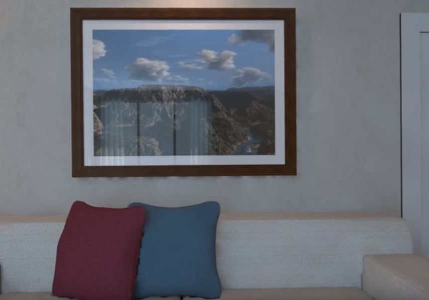](https://youtu.be/X0hx2vxxTMg)


## Important notes from the article

### Small size and embedded depth sensors
**PrimeSense** proposed first the now discontinued Capri 1.25 embedded camera sensor, which later the company bought by Apple for 365$ Million. 
[**Google Tango Penaut**](https://www.youtube.com/watch?v=5qsgmKgMQnM) and **Yellow stone** are  another projectswere  aiming on using depth sensors on mobile devices and embedded devices.
**Intel realsense smartphone** is also a smartphone using intel depth sensors.


## Questions
 What is ATE Metric ?


[article]: (https://link.springer.com/article/10.1007/s11554-017-0670-y)
[Khoshelham]:(https://pdfs.semanticscholar.org/63e1/dffc19c3b4e99ae22ec60d10eaaafd608bcb.pdf)